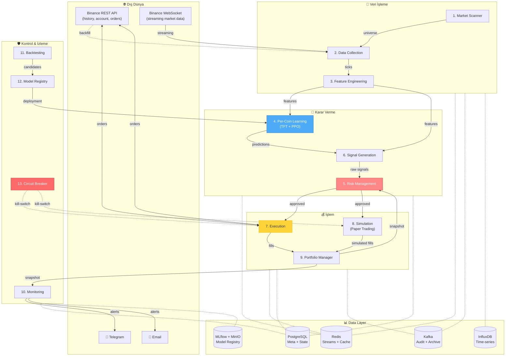

# MACTS — Sistem Mimarisi

> ⚠️ **VISION SPEC** — Bu doküman projenin **hedef durumunu** tanımlar, mevcut canlı sistemi değil.
> Mevcut durum için [STATUS.md](../STATUS.md), yol haritası için [ROADMAP.md](ROADMAP.md).
> Bu spec'in tamamı henüz uygulanmamıştır; bazı bölümler Faz 3+ tamamlandıkça hayata geçecektir.

---


## Genel Bakış

MACTS, **event-driven mikroservis** mimarisi üzerine kurulmuş bir multi-agent kripto trading sistemidir. Her agent bağımsız bir Docker container'ında çalışır, diğerleriyle yalnızca asenkron mesaj bus üzerinden iletişim kurar.

### Tasarım Prensipleri

1. **Loose coupling** — Agent'lar birbirini doğrudan çağırmaz, sadece mesaj yayınlar/dinler.
2. **Failure isolation** — Bir agent çökse diğerleri çalışmaya devam eder.
3. **Backpressure-aware** — Yüksek hacimde mesaj kuyruğu (Kafka) kullanılır.
4. **Idempotency** — Tüm trading işlemleri idempotent (clientOrderId ile).
5. **Observable** — Her agent Prometheus metrikleri expose eder, structured log üretir.
6. **Restart-resilient** — Critical state PostgreSQL'de persiste edilir.

---

## Sistem Diyagramı



---

## Mesaj Akış Şemaları

### 1. Veri Toplama Akışı (Real-time)

```
Binance WS combined stream
        │
        ▼
┌───────────────────────────┐
│ Data Collection Agent     │
│ - WebSocket multiplexing  │
│ - Reconnect & gap-filling │
└─────────────┬─────────────┘
              │
              ├──── stream:ticks.{symbol}.kline.{interval}  → Redis
              ├──── stream:ticks.{symbol}.trade             → Redis
              ├──── stream:ticks.{symbol}.depth             → Redis
              ├──── stream:ticks.{symbol}.markprice         → Redis
              │
              └──── macts.market.data                       → Kafka (arşiv)
              └──── InfluxDB (time-series persist)
```

### 2. Sinyal Üretim Akışı

```
Feature Engineering ──► stream:features.{symbol} ──► Per-Coin Learning
                                  │                          │
                                  │                          ▼
                                  │                stream:predictions.{symbol}
                                  │                          │
                                  ▼                          ▼
                          Signal Generation ◄────────────────┘
                                  │
                                  ▼
                          stream:signals.raw
                                  │
                                  ▼
                          Risk Management (approve/reject)
                                  │
                                  ▼
                          stream:signals.approved
                                  │
                          ┌───────┴───────┐
                          ▼               ▼
                      Execution      Simulation
                      (live mode)    (paper mode)
```

### 3. Kill-Switch Akışı

```
Trigger: flash crash | exchange outage | daily loss | correlation spike
        │
        ▼
┌─────────────────────┐
│ Circuit Breaker     │  ← BAĞIMSIZ container, en yüksek priority
└──────────┬──────────┘
           │
           │ stream:circuit_breaker.events
           │ stream:execution.commands { action: "close_all" }
           ▼
┌──────────────────────┐    ┌──────────────────┐
│ Execution / Sim      │    │ Monitoring       │
│ - Tüm pozisyonları   │    │ - Telegram alert │
│   piyasa emriyle     │    │   (critical)     │
│   kapat              │    └──────────────────┘
│ - Yeni emir kabul    │
│   etme (halt)        │
└──────────────────────┘
```

---

## Mesaj Bus Topolojisi

### Redis Streams (düşük gecikme)

| Stream | Yayıncı | Tüketici |
|---|---|---|
| `stream:universe.update` | Market Scanner | Data Collection |
| `stream:universe.snapshot` | Market Scanner | (broadcast) |
| `stream:ticks.{sym}.kline.{int}` | Data Collection | Feature Engineering |
| `stream:ticks.{sym}.trade` | Data Collection | Feature Engineering, Circuit Breaker |
| `stream:ticks.{sym}.depth` | Data Collection | Feature Engineering |
| `stream:ticks.{sym}.markprice` | Data Collection | Risk Mgmt, Portfolio |
| `stream:features.{sym}` | Feature Engineering | Per-Coin Learning, Signal Gen |
| `stream:predictions.{sym}` | Per-Coin Learning | Signal Generation |
| `stream:signals.raw` | Signal Generation | Risk Management |
| `stream:risk.assessment` | Risk Management | Signal Generation |
| `stream:signals.approved` | Signal Generation (post-risk) | Execution, Simulation |
| `stream:orders.events` | Execution | Portfolio, Monitoring |
| `stream:trades.executed` | Execution | Portfolio, Monitoring, Audit |
| `stream:portfolio.snapshot` | Portfolio | Risk, Monitoring |
| `stream:heartbeats` | Tüm agent'lar | Monitoring |
| `stream:alerts` | Monitoring | Notifier |
| `stream:circuit_breaker.events` | Circuit Breaker | Tümü (broadcast) |
| `stream:execution.commands` | CB, PM | Execution, Simulation |
| `stream:model.deployment` | Model Registry | Per-Coin Learning |
| `stream:backtest.results` | Backtesting | Model Registry |

### Kafka (yüksek hacim, kalıcı)

| Topic | Yayıncı | Tüketici | Retention |
|---|---|---|---|
| `macts.market.data` | Data Collection | Backtest, Audit | 7 gün |
| `macts.trade.events` | Execution | Audit, Compliance | 90 gün |
| `macts.audit.log` | Tüm agent'lar | Audit, Forensics | 365 gün |

---

## State Yönetimi

### Persistent State (PostgreSQL)
- Trades, Orders, Positions
- Cooldowns (restart sonrası tekrar yüklenir)
- Audit log
- Performance snapshots
- Model versions metadata

### Cached State (Redis)
- Universe snapshot
- Feature snapshots (son N tick)
- Korelasyon matrisi
- Volatility regime
- Distributed locks

### Time-series (InfluxDB)
- Klines (tüm interval'lar)
- Trades stream
- Order book snapshots
- Mark prices
- Funding rates
- Open interest history
- Performance metrics

### Object Storage (MinIO)
- Model checkpoint dosyaları (.ckpt, .zip)
- Backtest raporları (HTML, PDF)
- Feature importance plots

---

## Mod Geçişi Diyagramı

```
       ┌──────────┐  Sharpe>=1.5, DD<=15%      ┌────────┐
       │ Testnet  │ ─────────────────────────► │ Paper  │
       └──────────┘  Min 7 gün hatasız çalışma └───┬────┘
                                                   │
                                  Forward/Backtest │ >=0.7
                                  Min 30 gün       │
                                  Sharpe>=1.5      │
                                  DD<=15%          │
                                  WR>=52%          │
                                  PF>=1.4          ▼
                                              ┌────────┐
                                              │  Live  │
                                              │ Canary │
                                              └────────┘
                                              %10 → %25 → %50 → %100
                                              (her seviye 14 gün)
```
